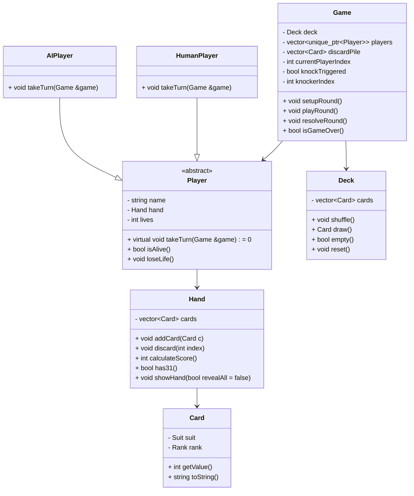
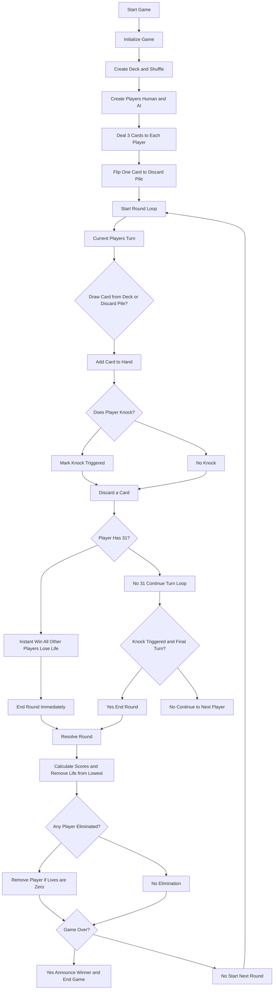

# 31 Card Game (C++ Console Edition) — Program Structure Outline

## 1. Overview

The program is designed with **object-oriented principles** and a modular structure.  
It separates **data representation, player logic, and game flow** for maintainability and scalability.

**High-level flow**:

1. Initialize game and players.
2. Shuffle deck and deal cards.
3. Players take turns drawing, optionally knocking, and discarding.
4. Check for 31 or knock-triggered end.
5. Score hands, remove lives, and check for elimination.
6. Repeat rounds until one player remains.

## 2. Core Classes & Responsibilities

### **2.1 Card**

- **Purpose**: Represents a single playing card.
- **Data Members**:
  - `Suit suit` — Hearts, Diamonds, Clubs, Spades
  - `Rank rank` — Two–Ace
- **Methods**:
  - `int getValue()` — Returns score value for the card.
  - `std::string toString()` — Returns a human-readable card name.

### **2.2 Deck**

- **Purpose**: Manages the deck of cards, shuffling, and drawing.
- **Data Members**:
  - `std::vector<Card> cards` — Active deck
- **Methods**:
  - `void shuffle()` — Randomizes card order.
  - `Card draw()` — Removes and returns top card.
  - `bool empty()` — Checks if deck is depleted.
  - `void reset()` — Resets deck to 52 cards.

### **2.3 Hand**

- **Purpose**: Represents a player’s 3-card hand.
- **Data Members**:
  - `std::vector<Card> cards`
- **Methods**:
  - `void addCard(Card)` — Adds card to hand.
  - `void discard(int index)` — Removes card by index.
  - `int calculateScore()` — Calculates best score for one suit.
  - `bool has31()` — Checks for exact 31.
  - `void showHand(bool revealAll = false)` — Displays hand in console.

### **2.4 Player (Abstract Base)**

- **Purpose**: Encapsulates shared player behavior.
- **Data Members**:
  - `std::string name`
  - `Hand hand`
  - `int lives`
- **Methods**:
  - `virtual void takeTurn(Game&) = 0` — Defines turn behavior.
  - `bool isAlive()` — Checks if player has lives remaining.
  - `void loseLife()` — Decrements life count.

### **2.5 HumanPlayer**

- **Purpose**: Implements `Player` behavior for human input.
- **Methods**:
  - `takeTurn(Game&)` — Prompts user to:
    - Draw (deck or discard)
    - Discard a card
    - Knock (optional)

### **2.6 AIPlayer**

- **Purpose**: Implements `Player` behavior for AI-controlled opponents.
- **Methods**:
  - `takeTurn(Game&)` — AI logic:
    - Draw from discard if beneficial
    - Discard lowest-value off-suit card
    - Knock if score meets threshold

### **2.7 Game**

- **Purpose**: Manages overall game flow, rounds, and state.
- **Data Members**:
  - `Deck deck`
  - `std::vector<std::unique_ptr<Player>> players`
  - `std::vector<Card> discardPile`
  - `int currentPlayerIndex`
  - `bool knockTriggered`
  - `int knockerIndex`
- **Methods**:
  - `void setupRound()` — Shuffle deck, deal hands, flip discard card.
  - `void playRound()` — Main turn loop:
    - Player draws
    - Player may knock
    - Player discards
    - Check for 31 or knock end
  - `void resolveRound()` — Compare scores, remove lives, handle elimination.
  - `bool isGameOver()` — Checks if only one player remains.

## 3. Program Flow

1. **Main Program**
    - Instantiate `Game` object with human + AI players.
    - Call `game.play()` loop until `isGameOver()`.
2. **Round Lifecycle**
    - `setupRound()` → shuffle and deal
    - Player turns in order:
        - Draw → Knock (optional) → Discard
        - Check for **31** → instant end if triggered
        - Track knock → allow one final turn after knock
    - `resolveRound()` → determine loser, remove life
    - Reset deck and hands for next round
3. **End of Game**
    - Announce winner (last player with lives).
    - Optionally prompt to play again.

## 4. Interaction Between Classes

- **Game** controls rounds, players, and deck.
- **Player** interacts with **Hand** and decides actions.
- **AIPlayer** adds automated decision-making.
- **HumanPlayer** handles console input.
- **Deck** and **Card** provide the data layer.

## 5. Program Flowchart

